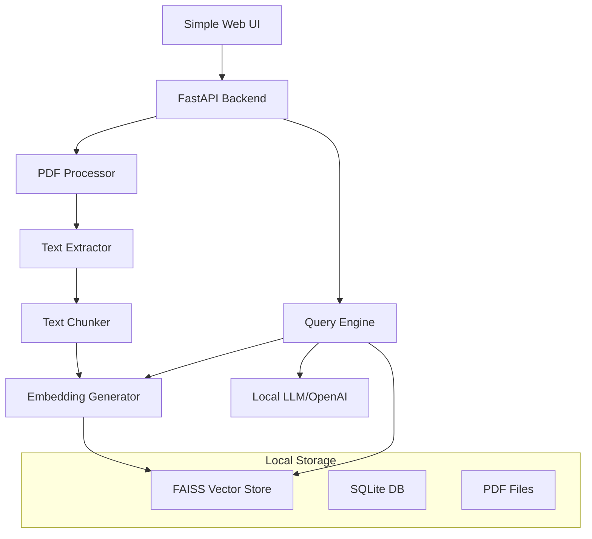

# Study Assistant RAG System Design

## Overview

The Study Assistant is a focused RAG system designed specifically for students to upload PDF textbooks and notes, then query them for exam preparation. The system uses a simple, learning-friendly architecture built with FastAPI backend and basic vector storage, avoiding complex frameworks like LangChain to maintain transparency and educational value.

## Architecture

### Recommended Tech Stack (Learning-Friendly)

**Backend:**
- **FastAPI**: Simple, fast Python web framework with automatic API docs
- **PyPDF2**: PDF text extraction (simple and reliable)
- **sentence-transformers**: Local embeddings (no API costs, works offline)
- **FAISS**: Facebook's vector similarity search (fast, local, no external dependencies)
- **SQLite**: Simple database for metadata storage
- **Ollama + Llama2/Mistral**: Local LLM (free, private, good for learning)

**Alternative (if you prefer cloud services):**
- **OpenAI API**: For embeddings and chat completion (paid but very reliable)

**Frontend:**
- **HTML/CSS/JavaScript**: Keep it simple for learning
- **Or React**: If you want to learn modern frontend

### Simple Architecture



### Why This Stack?

1. **FastAPI**: Easy to learn, great documentation, automatic API docs
2. **Local embeddings**: No API costs, works offline, good for learning
3. **FAISS**: Industry standard, fast, runs locally
4. **SQLite**: No setup required, perfect for learning and small projects
5. **Local LLM**: Private, free, educational value in understanding how LLMs work

## Components and Interfaces

### 1. FastAPI Backend

**Purpose**: Simple REST API for all study assistant operations.

**Key Endpoints**:
```
POST /upload-pdf          # Upload PDF study materials
GET /documents            # List uploaded documents  
DELETE /documents/{id}    # Delete document
POST /ask                 # Ask study questions
GET /health              # Health check
```

### 2. PDF Processor

**Purpose**: Extract text from PDF files and prepare for indexing.

**Interface**:
```python
class PDFProcessor:
    def extract_text(self, pdf_path: str) -> str
    def chunk_text(self, text: str, chunk_size: int = 800, overlap: int = 100) -> List[str]
    def process_pdf(self, pdf_path: str) -> List[TextChunk]
```

**Technology**: PyPDF2 (simple and reliable)

### 3. Embedding Generator

**Purpose**: Convert text chunks into vector embeddings for similarity search.

**Interface**:
```python
class EmbeddingGenerator:
    def __init__(self, model_name: str = "all-MiniLM-L6-v2")
    def encode_text(self, text: str) -> np.ndarray
    def encode_batch(self, texts: List[str]) -> np.ndarray
```

**Technology**: sentence-transformers (local, free, good quality)

### 4. Vector Store

**Purpose**: Store and search document embeddings efficiently.

**Interface**:
```python
class VectorStore:
    def add_documents(self, chunks: List[TextChunk], embeddings: np.ndarray)
    def search(self, query_embedding: np.ndarray, top_k: int = 3) -> List[SearchResult]
    def delete_document(self, doc_id: str)
```

**Technology**: FAISS (Facebook AI Similarity Search - fast and local)

### 5. Answer Generator

**Purpose**: Generate study-focused answers using retrieved context.

**Interface**:
```python
class AnswerGenerator:
    def generate_answer(self, question: str, context_chunks: List[str]) -> str
    def format_study_response(self, answer: str, sources: List[str]) -> StudyResponse
```

**Technology Options**:
- **Ollama + Llama2/Mistral** (local, free, private)
- **OpenAI GPT-3.5/4** (cloud, paid, very reliable)

### 6. Simple Web Interface

**Purpose**: Basic HTML interface for uploading PDFs and asking questions.

**Features**:
- PDF upload form
- Question input box
- Answer display with source references
- Document list and management

**Technology**: Simple HTML/CSS/JavaScript or basic React

## Data Models

### Document
```python
@dataclass
class Document:
    id: str
    filename: str
    upload_date: datetime
    file_size: int
    page_count: int
    chunk_count: int
```

### TextChunk
```python
@dataclass
class TextChunk:
    id: str
    document_id: str
    content: str
    chunk_index: int
    page_number: Optional[int] = None
```

### StudyQuestion
```python
@dataclass
class StudyQuestion:
    question: str
    max_chunks: int = 3
    response_style: str = "detailed"  # brief, detailed, comprehensive
```

### StudyResponse
```python
@dataclass
class StudyResponse:
    answer: str
    sources: List[str]  # List of "filename - page X" references
    processing_time: float
```

### SearchResult
```python
@dataclass
class SearchResult:
    chunk: TextChunk
    similarity_score: float
    document_name: str
```

## Error Handling

### Error Categories

1. **Document Processing Errors**
   - Unsupported file format
   - File corruption
   - Size limitations exceeded

2. **Embedding Service Errors**
   - API rate limits
   - Model unavailability
   - Invalid input format

3. **Vector Database Errors**
   - Connection failures
   - Index corruption
   - Storage capacity exceeded

4. **Generation Service Errors**
   - LLM API failures
   - Context length exceeded
   - Response filtering issues

### Error Response Format
```python
@dataclass
class ErrorResponse:
    error_code: str
    message: str
    details: Optional[Dict[str, Any]]
    timestamp: datetime
    request_id: str
```

### Retry Strategy
- Exponential backoff for API calls
- Circuit breaker pattern for external services
- Graceful degradation when services are unavailable

## Testing Strategy

### Unit Testing
- Component-level testing for all business logic
- Mock external dependencies (LLM APIs, embedding services)
- Test data validation and error handling

### Integration Testing
- End-to-end document processing pipeline
- Vector database operations
- API endpoint functionality

### Performance Testing
- Load testing for concurrent queries
- Embedding generation performance
- Vector similarity search benchmarks

### Test Data
- Sample documents in various formats
- Predefined query-answer pairs
- Edge cases and error scenarios

### Testing Tools
- pytest for Python components
- Jest for React frontend
- Locust for load testing
- Docker containers for isolated testing environments